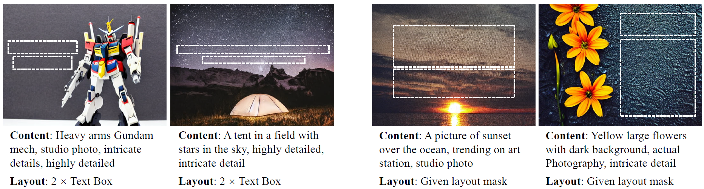

# Desigen: A Pipeline for Controllable Design Template Generation [CVPR'24]

### [Project Page](https://whaohan.github.io/desigen)  | [Paper](https://arxiv.org/abs/2403.09093) | [Data](https://drive.google.com/file/d/1M6om4DSk9wNgzjGLY5BtPNUL83KB8JVB/view?usp=sharing)

<p align="center">
  
</p>

## Requirement

1. Create a conda enviroment:

```bash
conda env create -n desigen python=3.8
conda activate desigen
pip install -r requirements.txt
```

2. Download [Bastnet](https://github.com/xuebinqin/BASNet) checkpoint into `saliency` folder.


## [Data Preparation](scripts/README.md)

1. Download meta data from [here](https://drive.google.com/file/d/1M6om4DSk9wNgzjGLY5BtPNUL83KB8JVB/view?usp=sharing).

2. Download and process background images.

3. Preprocess saliency map for background images.

4. Move the corresponding background images to the right directory.


## Background Generation

### Training

```bash
cd background/
# config accelerate first
accelerate config
# train the background generator
sh train.sh
```

More training settings can refer to [Diffusers](https://github.com/huggingface/diffusers/tree/main/examples/dreambooth).

### Evaluation

Generate background images with the prompts on validation set and evaluate them by the proposed metrics: FID, Salient Ratio and CLIP Score.

The pretrained saliency dectection mode can be download on [Basnet](https://github.com/xuebinqin/BASNet) and placed on `salliency` directory.

```bash
sh test.sh
```

## Layout Generation

### Training

```bash
cd layout/
sh train.sh
```

### Evaluation

Compute the layout given ground truth images and save them for further evaluation.

```bash
sh test.sh
```

## Pipeline Inference

Designs can be simply generated by the following command:

```bash
python pipeline.py \
--prompt "Rose Valentines' Day" \
--mode "background" \
--encoder_path /path/to/encoder \
--decoder_path /path/to/decoder \
--generator_path logs/background-ours
```

The `mode` parameter can also be swiched to `background` (background-only generation), `design` (design generation) or `iteration` (iterative refine).
A user-input attention reduction mask is also allowed by `mask_image_path`.

## Acknowledgements

Part of our code is borrowed from the following repositories:

1. [Huggingface Diffusers](https://github.com/huggingface/diffusers)
2. [Layout Trasformer](https://github.com/kampta/DeepLayout)
3. [Basnet](https://github.com/xuebinqin/BASNet)

## Citation

```tex
@misc{weng2024desigen,
      title={Desigen: A Pipeline for Controllable Design Template Generation}, 
      author={Haohan Weng and Danqing Huang and Yu Qiao and Zheng Hu and Chin-Yew Lin and Tong Zhang and C. L. Philip Chen},
      year={2024},
      eprint={2403.09093},
      archivePrefix={arXiv},
      primaryClass={cs.CV}
}
```